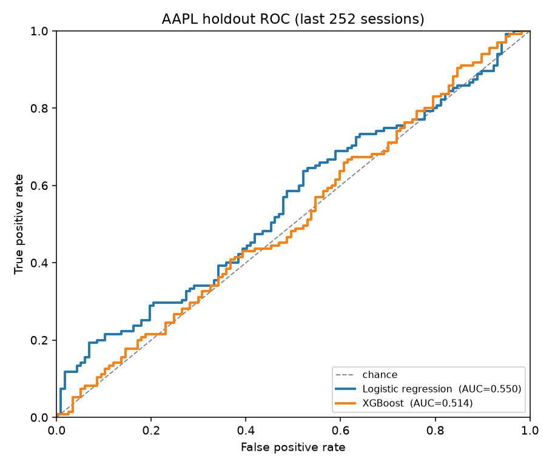
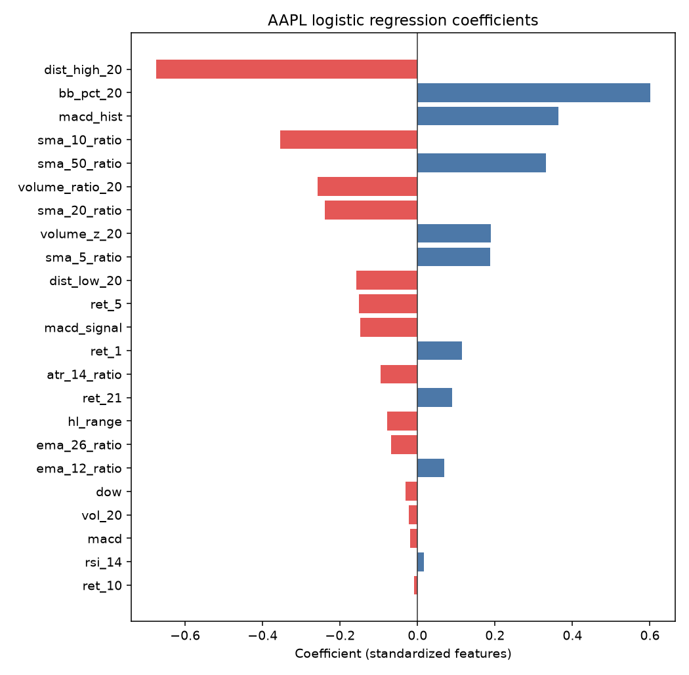
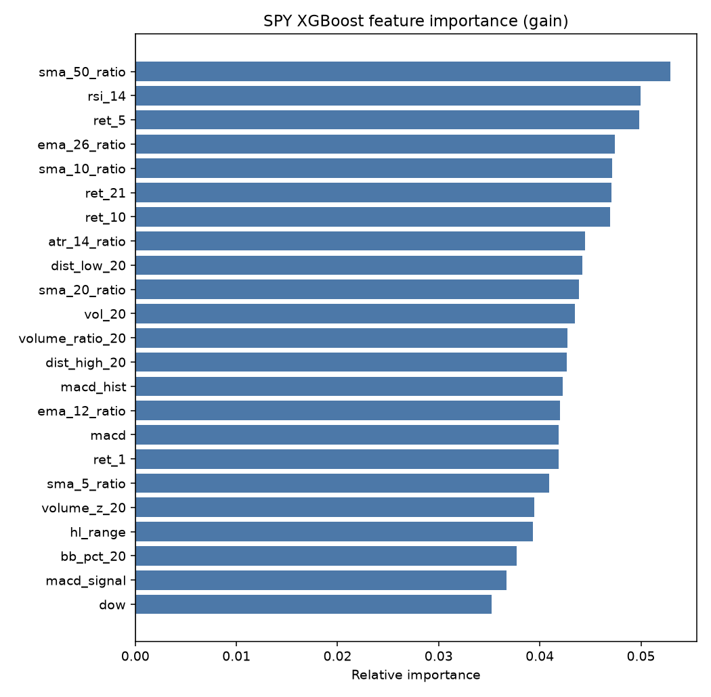
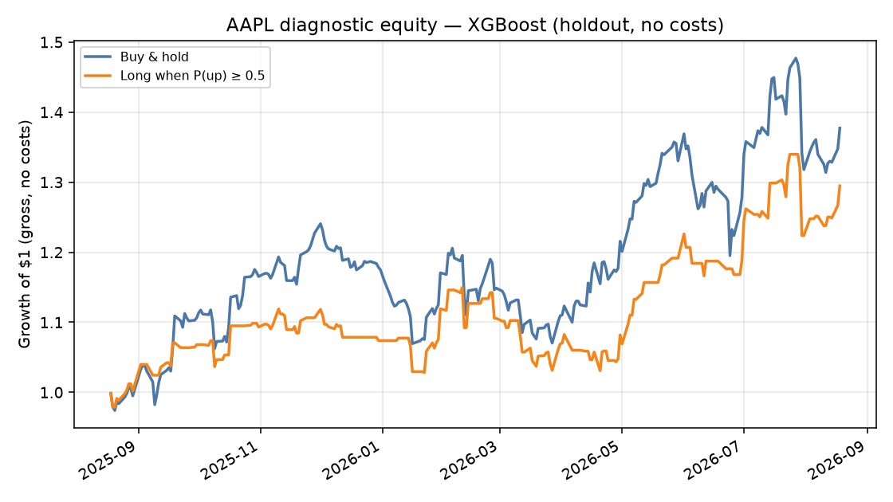

# Next-day stock direction classifier

**Bilal Abdullahi** · [github.com/bilal-a7](https://github.com/bilal-a7)

First ML engineering portfolio piece. The job is to predict whether **tomorrow’s close is higher than today’s** for `SPY`, `AAPL`, and `MSFT`. It is a **binary direction classifier**, not a trading system, not a price forecast, and not a claim of edge.

The headline result from the run that produced the artifacts in this repo: **neither model consistently beats an always-up baseline**. That is the honest outcome for daily equity direction with a short technical-indicator feature set. The engineering value is in the protocol — causal features, a sealed holdout, expanding-window walk-forward, and a live `predict` CLI that only sees data through today.

## Result (holdout: 2025-08-18 → 2026-08-18, 252 sessions)

| Ticker | Model | Accuracy | Precision | Recall | F1 | ROC-AUC |
|--------|--------|----------|-----------|--------|-----|---------|
| SPY | Logistic regression | 0.500 | 0.529 | 0.790 | 0.634 | 0.511 |
| SPY | XGBoost | 0.524 | 0.587 | 0.442 | 0.504 | 0.521 |
| SPY | Always-up / majority | **0.548** | 0.548 | 1.000 | 0.708 | 0.500 |
| AAPL | Logistic regression | **0.560** | 0.579 | 0.652 | 0.613 | **0.550** |
| AAPL | XGBoost | 0.504 | 0.536 | 0.548 | 0.542 | 0.514 |
| AAPL | Always-up / majority | 0.536 | 0.536 | 1.000 | 0.698 | 0.500 |
| MSFT | Logistic regression | 0.524 | 0.515 | 0.810 | 0.630 | 0.496 |
| MSFT | XGBoost | 0.484 | 0.486 | 0.540 | 0.511 | 0.475 |
| MSFT | Always-up / majority | 0.500 | 0.500 | 1.000 | 0.667 | 0.500 |

Always-up is the right naive baseline here: equities drift up, so a constant “tomorrow is up” call already gets ~50–55% accuracy. ROC-AUC is the number I would actually use to decide if there is ranking signal; it sits on top of 0.50. AAPL logistic regression is the only holdout cell where both accuracy and AUC clear the baseline, and even that is a small, single-year effect.

Walk-forward (5 expanding folds on the development set, mean ± std) is noisier and less flattering:

| Ticker | LogReg AUC | XGBoost AUC | Always-up accuracy |
|--------|------------|-------------|--------------------|
| SPY | 0.485 ± 0.036 | 0.479 ± 0.056 | 0.547 ± 0.066 |
| AAPL | 0.516 ± 0.052 | 0.495 ± 0.055 | 0.537 ± 0.064 |
| MSFT | 0.468 ± 0.028 | 0.441 ± 0.055 | 0.528 ± 0.043 |

I did **not** pick a production model off the holdout. Walk-forward mean AUC is slightly higher for logistic regression on all three names. The CLI still defaults to XGBoost because that default was declared before looking at holdout numbers; pass `--model logreg` to use the linear model. Full numbers: [`reports/metrics.json`](reports/metrics.json).



SPY and MSFT curves are in [`reports/roc_SPY.png`](reports/roc_SPY.png) and [`reports/roc_MSFT.png`](reports/roc_MSFT.png). They hug the diagonal.

## Problem

Given the daily OHLCV bar that just closed, classify:

```
y_t = 1{ close_{t+1} > close_t }
```

Ties count as down. Features at `t` may use `open/high/low/close/volume` with index `≤ t` only. The last session in any download has no label, so it is dropped from training and kept only for live inference.

This is a deliberately hard problem. Daily direction of liquid US names is close to a coin flip after the upward drift is accounted for. A project that “gets 80% accuracy” on this task is usually leaking the future. I would rather show a clean 0.51 AUC than a dirty 0.70.

## Data

- Source of truth: [yfinance](https://github.com/ranaroussi/yfinance), `period="5y"`, `interval="1d"`, `auto_adjust=True` (splits and dividends already in OHLC).
- This run: 2021-08-20 → 2026-08-19, 1,254 raw sessions per ticker. After SMA-50 warmup and dropping the unlabeled last row: **1,204 rows**, 2021-10-29 → 2026-08-18.
- Cache: `data/raw/{TICKER}.csv` so re-runs do not hammer Yahoo. The cache is gitignored. `--refresh` re-downloads.
- Development set: first 952 labeled rows (through 2025-08-15). Holdout: last 252 rows.

No frozen Kaggle CSV. If Yahoo is down, the trainer retries with exponential backoff (5 attempts).

## Features

All windows are backward-looking (`rolling`, `ewm(adjust=False)`, Wilder RSI). Ratios are used instead of raw moving averages so logistic regression is not dominated by the absolute price level of AAPL vs SPY.

| Feature | What it is |
|---------|------------|
| `ret_1`, `ret_5`, `ret_10`, `ret_21` | Simple returns over 1/5/10/21 sessions |
| `sma_{5,10,20,50}_ratio` | `close / SMA - 1` |
| `ema_{12,26}_ratio` | `close / EMA - 1` |
| `rsi_14` | Wilder RSI |
| `macd`, `macd_signal`, `macd_hist` | MACD line, signal, histogram, **divided by close** so the scale is comparable over time |
| `vol_20` | 20-session std of daily returns |
| `volume_ratio_20`, `volume_z_20` | Volume vs its 20-session mean / z-score |
| `hl_range` | `(high - low) / close` |
| `atr_14_ratio` | Wilder ATR / close |
| `bb_pct_20` | Bollinger %b (20, 2σ) |
| `dist_high_20`, `dist_low_20` | Close vs 20-session high / low |
| `dow` | Day of week (known at close; a calendar effect, not a price leak) |

Rows with NaN after indicator warmup are dropped. Tests in `tests/test_leakage.py` check that chopping future rows, or perturbing `close[t+1]`, does not change features at `t`.

## Models and why these two

**Per-ticker models**, not one pooled model with a ticker ID. SPY is an index; AAPL and MSFT have their own event risk and volatility regimes. With only three names, a pooled model mostly shares noise. Per-ticker also makes the ROC and coefficient plots inspectable in a hiring conversation. The cost is no sharing of statistical strength — acceptable for v1.

1. **Logistic regression** in a `StandardScaler → LogisticRegression(C=1.0)` pipeline. Linear, calibrated-enough, fast. The thing you have to beat.
2. **XGBoost** (`max_depth=3`, `n_estimators=200`, `learning_rate=0.05`, `subsample=0.8`, `min_child_weight=5`). Shallow trees on purpose: 23 features and ~950 training rows is not a setting where a deep booster earns its capacity. `scale_pos_weight` is set from the **train fold only**.

Hyperparameters are fixed. Nothing was searched against the holdout. Random seed is 42.

## Validation (the part that actually matters)

```
full labeled series
├── development (all but last 252 rows)
│   └── sklearn TimeSeriesSplit(n_splits=5)   # expanding window
│       fold k train = rows [0, train_end_k)
│       fold k test  = the next contiguous block
└── holdout (last 252 rows)                   # scored once, after fitting on development
```

`TimeSeriesSplit` is expanding, not sliding: later folds get more history. With ~5 years of daily bars, throwing away the early sample to make a sliding window would waste data without buying a more realistic “recent-only” regime. Each fold’s test block starts after its train block; tests assert `train_dates.max() < test_dates.min()` and that train always starts at the first development row.

The holdout is a single year of daily decisions. That is small. Walk-forward exists so I do not tell a story from one lucky year. Accuracy is reported because people ask; **AUC and the always-up baseline** are what I look at.

## What the models actually use

AAPL logistic regression (standardized coefficients) is mostly a mean-reversion vs trend argument: distance from the 20-session high is a large negative weight (stretched = more likely down tomorrow), Bollinger %b and MACD histogram go the other way. These are correlated features; the signs should not be over-interpreted.



XGBoost gain on SPY is almost flat across the 23 features (~0.035–0.053). That is what “no dominant signal” looks like, and it matches the AUC.



The equity plot is a **diagnostic**, not a backtest. Long AAPL when XGBoost P(up) ≥ 0.5, else cash; no costs, no slippage, no sizing. On this holdout, buy-and-hold wins. That is consistent with a classifier that does not beat always-up.



Same plots for SPY and MSFT live under [`reports/`](reports/).

## How to run

Python 3.11+ (developed on 3.13).

```bash
python -m venv .venv
source .venv/bin/activate
python -m pip install -r requirements.txt
python -m pip install -e .

python -m stock_direction.train              # uses data/raw cache if present
python -m stock_direction.train --refresh    # re-download from yfinance

python -m stock_direction.predict            # XGBoost, latest daily bars
python -m stock_direction.predict --model logreg

python -m pytest -q
```

`predict` pulls a fresh ~2y of daily bars (enough for SMA-50 warmup), scores the **last completed session**, and prints tomorrow’s call. Example from this machine on 20 Aug 2026 (London):

```
Ticker  As of            Close    P(up)  Call    Model
----------------------------------------------------------
SPY     2026-08-19      769.06    0.708  UP      xgb
AAPL    2026-08-19      316.83    0.583  UP      xgb
MSFT    2026-08-19      484.31    0.435  DOWN    xgb
```

Those probabilities are model outputs, not a trade ticket.

## Layout

```
src/stock_direction/
  config.py      tickers, paths, feature list
  data.py        yfinance download, retries, CSV cache
  features.py    causal indicators + next-day target
  train.py       walk-forward, final fit, artifacts
  evaluate.py    metrics, ROC, importance, diagnostic equity
  predict.py     live next-day calls
tests/           leakage, date order, feature generation
models/          committed joblib artifacts + meta.json
reports/         metrics.json + pngs from the training run
data/raw/        gitignored cache
```

## Limitations

- **No economic edge shown.** Always-up wins accuracy on SPY. MSFT XGBoost is worse than chance on both CV and holdout.
- 252-day holdout is one regime. 2025–2026 is not “the market.”
- Technicals on adjusted daily bars ignore overnight news, earnings, and macro prints — the things that actually move AAPL and MSFT on many days.
- Logistic regression on collinear ratios (SMA/EMA/MACD family) has unstable coefficients; that is a feature of the model class, not a bug in the plot.
- No transaction costs, borrow, or execution lag. `predict` assumes you can act on the close that just printed, which you generally cannot.
- Three tickers, US cash equities only.
- yfinance is a scraping wrapper, not a paid data vendor. History can be revised.

## What I would do next

1. Freeze a model-selection rule on walk-forward AUC **before** opening holdout (logreg would win today).
2. Replace the binary call with a probability and evaluate Brier / calibration — direction accuracy is a harsh, low-powered metric.
3. Add a simple costed P&L with a decision threshold other than 0.5, still labeled as research.
4. Try a pooled model with ticker embeddings once the universe is tens of names, not three.
5. Regime features (realized vol percentile, index trend) instead of more oscillators.
6. Earnings calendar as a known-at-close dummy for AAPL/MSFT.
7. Wider walk-forward (purged CV with an embargo) if the feature set starts using longer lookbacks.

## Tests

`python -m pytest -q` — 14 tests, including:

- features at `t` unchanged when future rows are deleted or `close[t+1]` is perturbed
- target is exactly `close[t+1] > close[t]`, and is not in the feature matrix
- `TimeSeriesSplit` is expanding and forward-only
- RSI in `[0, 100]`; warmup NaNs are dropped

Not financial advice. The models in `models/` are reproducible artifacts from the training run documented in `reports/metrics.json`, generated 20 Aug 2026.
